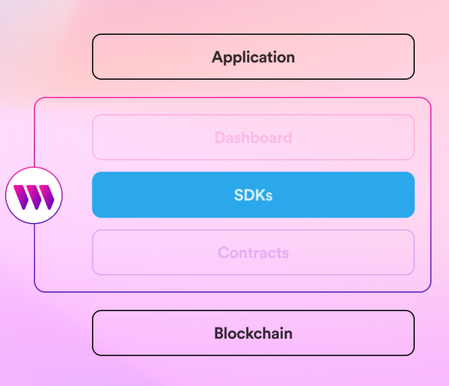

# Welcome to thirdweb

thirdweb is a web3 application framework that enables you to easily build powerful, blockchain-based applications.

With an intuitive dashboard, SDKs for the most popular languages, and audited pre-built contracts that you own and control, thirdweb offers a full suite of tools for teams to build and launch web3 apps to production with.

thirdweb lowers the bar for developers to transition their existing skills into the web3 development space by reducing the complexities of interacting with smart contracts with familiar concepts and by providing intuitive, easy-to-use SDKs.

We offer tools to help you every step of the way, from creating and deploying your contracts on a testnet to giving your users an optimized experience in production.

All of our tools aim to provide a seamless developer experience with built-in features including:

- **Audited, pre-built smart contracts** for you to deploy on all the top blockchains.
- **Intuitive, multi-language SDKs** that reduce the learning-curve of becoming productive in web3.
- **Easy to use UI components** to solve common problems like letting users connect their wallet or send transactions.

thirdweb is used by tens of thousands of active builders and trusted by some of the world's top organizations in production. Additionally, we give you direct access to talk to our engineers and get detailed answers about all the quirks and nuances of your project in our [Discord](https://discord.com/invite/thirdweb)!

## How thirdweb simplifies Web3 development

Building web3 apps is hard, and the cost of mistakes can be extremely high.

Whether you're building a completely new web3 application or integrating web3 mechanics into you're existing app, there are many important details to consider:

- You need to be confident your smart contracts are safe from **exploits**.
- You need to account for a number of **web3 concepts**; like IPFS, RPCs, indexing, and connecting to your users' wallets.
- You may have to manage your team’s **access to resources** and configure payment structures or royalties.
- Your users expect seamless, **optimized** experiences and interactions they can trust.

**thirdweb** provides the solution to all of the above considerations. We've created the ultimate web3 app framework to delight both **developers** who use our tools as well as the **end-users** who interact with the apps built on top of our solutions.

## How does thirdweb fit into your stack?

thirdweb has tools to enable and enhance your web3 application at every step in the development stack. All of thirdweb’s tools are [open source](https://github.com/orgs/thirdweb-dev) and completely server-less. This means we’re not using databases behind the scenes, or any centralization that relies solely on thirdweb for your applications to work.

Let’s explore thirdweb’s three core pillars:

1. Contracts
2. SDKs
3. The Dashboard

### Contracts

Smart Contracts are the fundamental layer of any web3 tech stack. They’re responsible for storing your applications data on the blockchain.

You can deploy one of our [pre-built contracts](/pre-built-contracts) onto a blockchain of your choice, or you could extend your custom-built contracts using [thirdweb deploy](/thirdweb-deploy) to give you all of thirdweb's capabilities in your own contract.

Our [pre-built contracts](/pre-built-contracts) are audited by top-tier auditing firms such as Shipyard and 0xmacro to provide you with full confidence in their capabilities and safety. All of thirdweb’s contracts are [open-source](https://github.com/thirdweb-dev/contracts), meaning you can review these contracts yourself and explore the intricacies and details within them at any time.

Any contract deployed on thirdweb is 100% owned by the wallet that deploys it. Meaning if thirdweb were to ever shut down, your smart contracts are still available to you on the blockchain. Not only that, it's around **10x cheaper** to deploy thirdweb's pre-built contracts compared to deploying them yourself, using our proxy contracts.

:::tip Learn more

- [thirdweb pre-built contracts](/pre-built-contracts)
- [your own contracts](/thirdweb-deploy) (thirdweb deploy)

:::

### SDKs

We provide SDKs to interact directly with your smart contracts in your favorite languages, including:

- [JavaScript (TypeScript)](/typescript)
- [React.JS](/react)
- [Python](/python)
- _Go (coming soon)_

thirdweb's SDKs connect your application to your smart contracts, which allows you to easily read and write data to them.

Within the SDK, we do all the heavy lifting, like connecting to the blockchain via RPC, configuring which networks you want to support, fetching data from IPFS, caching results from the blockchain for faster responses, and much more.

In addition to the pre-built functionalities, we generate additional SDK capabilities dynamically if you're using a custom contract.

### Dashboard

thirdweb's dashboard is an easy-to-use tool letting you configure permissions, set platform and royalty fees, and share access to your contracts with your team members.

Our dashboard natively supports multi-sig wallets including Gnosis safe, making it perfect for teams and organizations to access and configure your smart contracts with.

The dashboard also enables you to configure and deploy any of thirdweb’s [pre-built contracts](/pre-built-contracts), and perform common functionalities such as minting without writing any code.

Within the dashboard, we provide simple code snippets for you to get started, and give you visual representations of what is happening on your smart contract; like all the NFTs that have been minted in your collection, or what is currently listed on your marketplace.

You can also perform common admin operations like burning your NFTs, removing listings from your marketplace, or deleting your smart contract completely. Within the dashboard, you’re able to manage your teams payments and distribute the funds that you’ve received from within your smart contract with the click of a button.

**Next up**

We’ll show you how you can deploy your first smart contract with thirdweb and easily connect it into your apps with just a few simple lines of code.
