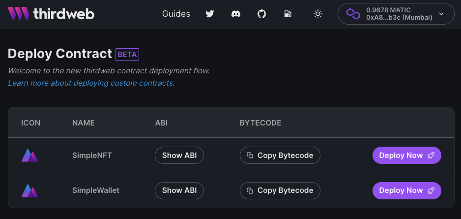
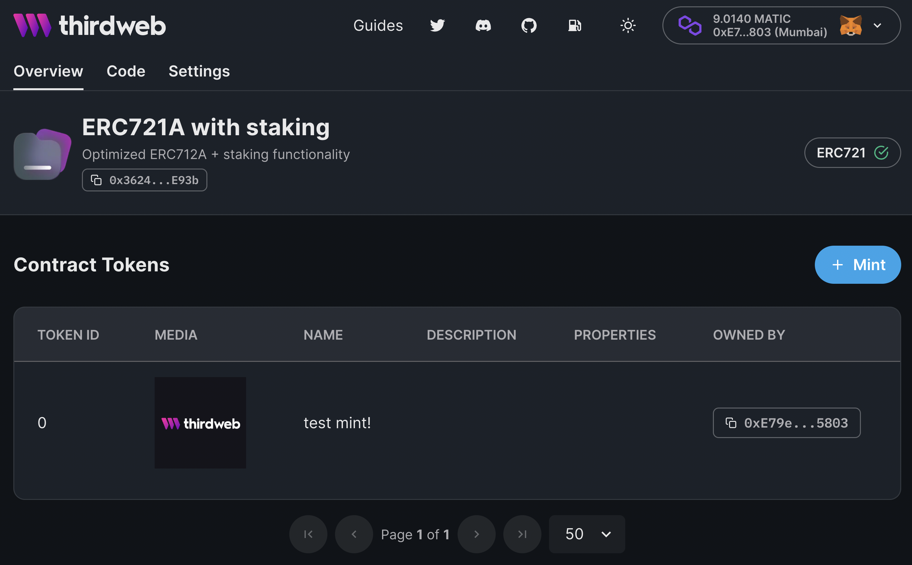

# thirdweb deploy

- Deploy your smart contracts without dealing with private keys or scripts
- Automatic SDKs for your contracts - javascript, python, node (go/unity/ios/android soon)
- Manage contracts with an intuitive dashboard
- Publish contracts for your team or public use
- See whats happening on-chain with analytics

<div style={{position: "relative", paddingBottom: "64.86486486486486%", height: 0}}><iframe src="https://www.loom.com/embed/593fa3988dc24a188f7a1aa2cbbeb3cd" frameBorder="0" allowFullScreen style={{position: "absolute", top: 0, left: 0, width: "100%", height: "100%"}}></iframe></div>

## 🕸️ What is thirdweb deploy?

---

Our mission is to make it easy to develop web3 apps & games. Currently our platform offers a variety of pre-built smart contracts (NFT Drops, Marketplaces, Voting, Splits, etc) that you can integrate into your application by using our SDKs and Dashboard.

**We are extending thirdweb to support any smart contracts you develop!**

You can now deploy your own smart contracts and get all the benefits of the thirdweb platform: SDKs, Dashboards and Analytics for **free**.

If you have a smart contract (_ERC721A, Staking, Yield Farming, your own, etc)_ and want to build apps with it, this feature is for you!

Write your solidity smart contract, deploy through thirdweb and enjoy the benefits for free:

- Automatic SDK - interact with your contracts easily
- Manage your contracts using our dashboard
- See activity of your contracts in our dashboard

## 🚀 Getting started

---

Once you have a solidity contract (your own or from Github) you can enable thirdweb with a few steps:

**Install the contracts package**

```bash npm2yarn
npm install @thirdweb-dev/contracts
```

**Extend ThirdwebContract in your Solidity code**

```solidity
// SPDX-License-Identifier: MIT
pragma solidity ^0.8.4;

import "@thirdweb-dev/contracts/ThirdwebContract.sol";

contract MyCustomContract is ThirdwebContract {
    // ... your contract code
}
```

**Deploy it**

```bash
npx thirdweb deploy
```

This command will:

- auto-detect any contract that extends `ThirdwebContract` in your project
- compile your project
- Upload ABI and bytecode to IPFS
- Generate a deploy link

Follow the link to the dashboard where you can connect a wallet (or a multi-sig like gnosis) to deploy your code to blockchains from your browser connected wallet. **No copy/pasting private keys or complex scripting required!**



We currently support hardhat,forge, truffle, brownie projects, and even raw solc compilation! For more information on the thirdweb CLI, head over to our [thirdweb CLI github repository](https://github.com/thirdweb-dev/thirdweb-cli).

You can deploy a specific instance of the contract directly from your dashboard, specifying basic contract metadata and parameters.


Once deployed, you can immediately **start interacting with your deployed contract using automatically thirdweb SDKs**! Your contract dashboard will show how to get started and how to call functions on your contract.


If your contract implements any common EIP specification - like ERC20, ERC721, ERC1155 and more - we auto detect this in the SDK and in our dashboard. This means you get the **same intuitive APIs in React, Typescript and Python** and **convenient web dashboard** that you would get with our built-in contracts.

### 💻 Javascript / Typescript SDK

---

**Installation**

```bash npm2yarn
npm install @thirdweb-dev/sdk
```

**EIP Feature detection:**

```jsx
// interact with your contract without dealing with ABIs
const contract = await sdk.getContract("0x...");

// call any contract function (see dashboard for list of function signatures)
await contract.functions.someCustomFunction();

// if your contract follows the ERC721 standard, contract.nft will be present
const allNFTs = await constract.nft.query.all();

// if your contract extends IMintableERC721, contract.nft.mint will be present
const tx = await contract.nft.mint.to("0x...", {
  name: "Cool NFT",
  image: readFileSync("some_image.png"),
});
```

Find out more in our [documentation](/typescript).

### 💻 React SDK

---

**Installation**

```bash npm2yarn
npm install @thirdweb-dev/react
```

**Contract hooks**

```jsx
// Use your contract in a react project
const { contract, isLoading, error } = useContract("0x....");

// if your contract follows the ERC721 standard you use custom "NFT" hooks
const { data: nfts, isLoading, error } = useNFTList(contract);

//if your contract extends IMintableERC721, you can mint using hooks
const { mutate: mint, isLoading, error } = useNFTMint(contract);
mint({
  name: "Cool NFT",
  image: readFileSync("some_image.png"),
});
```

Find out more in our [documentation](https://docs.thirdweb.com/react).

### 💻  Python SDK

---

**Installation**

```bash
pip install thirdweb-sdk
```

**EIP Feature detection:**

```python
# interact with your contract without dealing with ABIs
contract = sdk.get_custom_contract("0x...")

# read data from your contract
contract.functions.balance().call()

# send transactions
contract.send_transaction("mintTo", ["0x...", "ipfs://..."])

# if your contract follows the ERC721 standard, get convenience APIs
contract.nft.balance()
```

Find out more in our [documentation](https://docs.thirdweb.com/python/custom).

### 🌎 Dashboard

---

Your contract dashboard page also auto detects standard functionality like ERC721 to lists your contract tokens, and even mint functionality.



### 📜 Contract SDK

---

We support any contract that you’ll write and you can use the SDK to call raw functions on it. But to get the full thirdweb convenience, APIs and dashboard functionality, you can extend your dashboard with our contract interfaces to enable specific features in the SDK and dashboard.

```solidity
// SPDX-License-Identifier: MIT
pragma solidity ^0.8.4;

import "@thirdweb-dev/contracts/ThirdwebContract.sol";
import "@thirdweb-dev/contracts/feature/interface/IMintableERC721.sol";

// Adding IMintableERC721 and implementing it gives you
// SDK -> contract.nft.mint with auto upload to IPFS
// Dashboard -> Mint button on admin dashboard
contract MyCustomContract is ThirdwebContract, IMintableERC721 {

	function mintTo(address to, string calldata uri) external returns (uint256) {
		// implement your mint function
	}
}
```

| Contract interface   | SDK                   | Dashboard                   |
| -------------------- | --------------------- | --------------------------- |
| ERC20                | contract.token        | Token information / balance |
| IMintableERC20       | contract.token.mint   | Mint tokens button          |
| ERC721               | contract.nft          | List of NFTs                |
| IMintableERC721      | contract.nft.mint     | Mint NFT button             |
| ERC1155              | contract.edition      | List of NFTs                |
| IMintableERC1155     | contract.edition.mint | Mint NFT button             |
| IThirdwebRoyalty     | contract.royalties    | Royalties admin UI          |
| IThirdwebPrimarySale | contrat.sales         | Sales admin UI              |
| IThirdwebPlatformFee | contract.platformFee  | Platform fees admin UI      |

Find out more in our [documentation](https://docs.thirdweb.com/contracts).

:::info Early access disclaimers

This an early preview that comes with some limitations for this alpha release

- Requires Solidity > 0.8.0
- Only supports publishing and deploying on testnets

Since this is an early preview, be prepared for your published contracts to not be accessible anymore once we launch this product fully.

:::

## 🛠️ We want to hear from you

---

Join our [Discord](http://discord.gg/thirdweb). Head to the [#general](https://discord.com/channels/834227967404146718/834227967404146721) channel and say: “i’m a builder. here for the alpha.”

We’ll grant you a role to access to the [builders alpha channel](https://discord.com/channels/834227967404146718/967114171118387272) where you can share your _feedbacks_ and _bug reports_ to our engineering team.

3 things we want to know from you (share them in the alpha channel):

- What were your first impressions using the flow?
- What’s your favorite thing about the tool / workflow?
- What features would you like us to add next?
